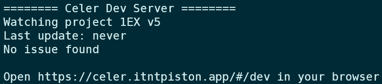

# What Do I Need to Install?
Celer has 2 parts - a web app (UI) to view the route docs, and a client program to build the route doc from source code. 
- If you are viewing routes, you don't need to install anything. 
- If you are making routes, you need to install the Celer Devtool below

You can also install optional components, outlined in the end of this guide

# Install Celer Devtool
Celer Devtool is a native program that loads route files from you computer and sends them to the web app for preview

## Install/Update with Setup Script (Recommended)
#### Windows
1. Open Powershell **as Administrator** [click here if you don't know how](https://www.google.com/search?q=how+to+open+powershell+as+administrator&rlz=1C1VDKB_enUS959US959&oq=how+to+open+powershell+as+administrator&aqs=chrome..69i57.4261j0j7&sourceid=chrome&ie=UTF-8)
2. Copy and paste this command into powershell and run 
```powershell
iwr -useb https://celer.itntpiston.app/setup-windows.ps1 | iex
```
3. Choose 1 to install/update and 2 to uninstall
4. Type where you want to install, or leave empty to install to default location `~/.celer`. Press enter
5. The script will download the latest release and install it automatically. Restart powershell when it's done
6. run `celer` to verify installation 

**NOTE** If you see an error when you restart powershell about script execution is not allowed, execute the following command to change the execution policy
```powershell
Set-ExecutionPolicy RemoteSigned
```
Restart powershell and now it should work

#### Linux/Mac
If you are installing to a location that needs root permission:
```shell
sudo bash -c "$(curl -fsSL https://celer.itntpiston.app/setup.sh)"
```
Otherwise:
```shell
bash <(curl -s https://celer.itntpiston.app/setup.sh)
```

## Uninstall with Setup Script
If you want to uninstall celer. Follow the same setups above to load the setup scripts, and choose `Uninstall` instead of `Install/Update`

## Manual Install
You can download the binary yourself from the [release page](https://github.com/iTNTPiston/celer/releases) if you would like.

# Getting Started with Devtool
In this section, you will create a sample project with the devtool and load it in the web app

## Create `main.celer`
1. Create a new folder on your computer to store the route files
2. Open terminal
    - Windows 10: `shift`+right click in file explorer and choose `Open PowerShell window here`.
    - Windows 11: `shift`+right click in file explorer, choose `Show more options`, then choose `Open PowerShell window here`
3. Run `celer new`
4. Follow the prompts and enter relevant information. You can also leave them blank and manually edit them in `main.celer` later
5. There should now be a new file `main.celer` in that folder.

## Preview with Celer Dev Server
`main.celer` contains an example route doc that you can preview with the dev server

1. In the terminal, run `celer dev`
2. You should see something like this


3. Open the url in your browser https://celer.itntpiston.app/#/dev
4. You should see the sample route

# Optional Components
The devtool is really all you need to get started. If you would like however, here are some extra features you can install

- [Language Extensions](./Tutorial/Install%20Language%20Extension.md): Enable syntax highlighting and auto completion when write routes. Currently only for VS Code

(there's only 1 optional component at this point)

# Next Steps
You learned how to use the dev tool. Next, you can follow the [tutorials](./Tutorial/order.txt) to learn how to write the route document
