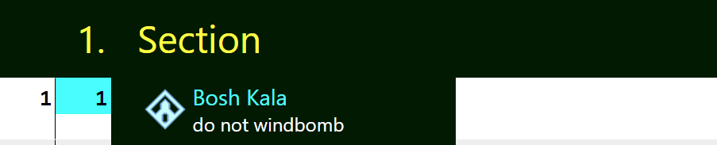

This tutorial is about presets. Presets are pre-defined steps that you can reuse.

# Basic Syntax
Presets start with `_`, followed by a C++ like syntax with `_<namespace>::<value>`. For example, `_Shrine::BoshKala` is the preset for Bosh Kala Shrine

To use a preset, just write the preset name in the place of a step
```yaml
_route:
- Section:
  - _Shrine::BoshKala

## The above is the same as

_route:
- Section:
  - .loc(Bosh Kala):
      icon: shrine
      split-type: Shrine
      coord: [87.02, 122.52, 1658.71]
      time-override: 8
```

This renders into


# Extend Presets
Presets can also be further customized in the same way as regular steps. For example:
```yaml
_route:
- Section:
  - _Shrine::BoshKala:
      comment: do not windbomb
```


# Available Presets
To see what presets are available: https://celer.itntpiston.app/#/docs/presets
