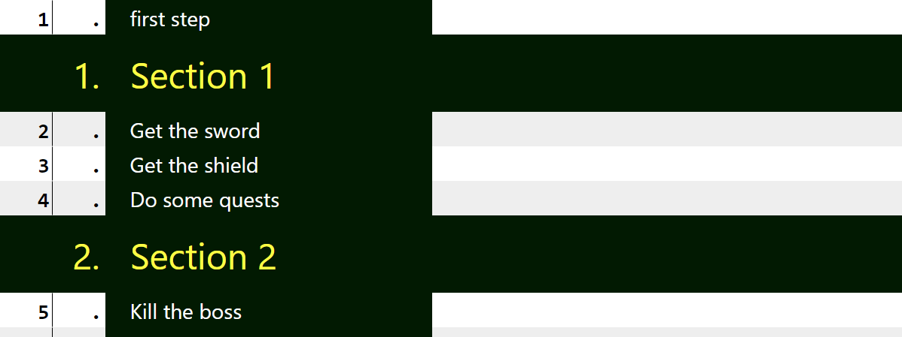
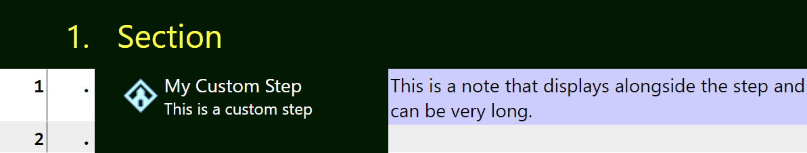
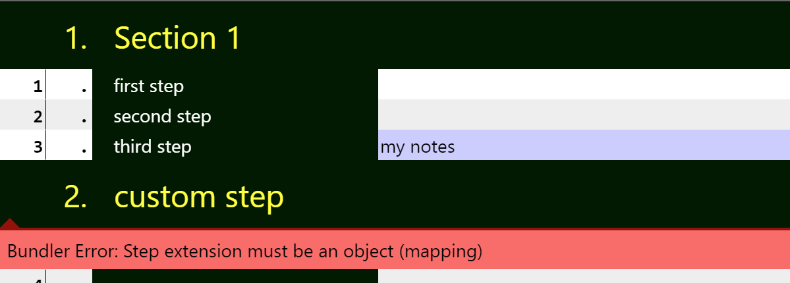

The `_route` section in your celer files defines the route. As an example:
```yaml
_route:
- first step
- Section 1:
  - Get the sword
  - Get the shield
  - Do some quests
- Section 2:
  - Kill the boss
```
This route renders to



# Steps
`Step` is the technical term for lines in the doc. Each line in the route doc correspond to a step in the route files. In the example above, it has 5 steps: `first step`, `Get the sword`, `Get the shield`, `Do some quests` and `Kill the boss`. We will look into what `Sections` are but don't worry about them right now.

There are 2 types of steps - **Simple Steps** and **Extended (Customized) Steps**

## Simple Steps
All of the steps in the example above is are simple steps. They are basically plain-text, although you can format them with [Typed String](./Typed%20String%20System.md)

## Extended (Customized) Steps
You can make the route doc richer by using extended, or customized steps. For example:
```yaml
_route:
- Section:
  - My Custom Step:
      icon: shrine
      comment: This is a custom step
      notes: This is a note that displays alongside the step and can be very long.
```
This renders into



To write a customized step, put `:` after the step text, and put `<property>: <value>` pairs in each line after that. Note that properties need to be further indented after the step. In the example above, it overrides 3 properties of the step: `icon`, `comment` and `notes`. The properties can be in any order. To see a full list of properties, check out [this page](./Step%20Customization.md)

**Note that the example custom step is inside a section.** Customized steps must be inside a section because the syntax is the same (See below)

# Sections
Sections are used to group steps together. The route doc will also render a header for each section.

To make a section, write `<section name>:`, and write the steps as an array
```yaml
_route:
- Section 1:    # Write the section name, then a :
  - first step  # Step inside needs to be indented
  - second step
  - third step:
      notes: my notes # Step inside section can be customized
- custom step:
    notes: is this allowed? # No. Custom steps CANNOT exist outside of sections, because there is no way for the program to tell if this is meant to be a section or a step
```
This renders into



Notice the error caused by having a custom step outside of a section. The engine interprets it as a section, so the syntax inside is invalid
