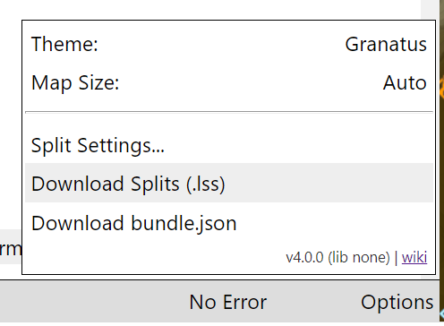
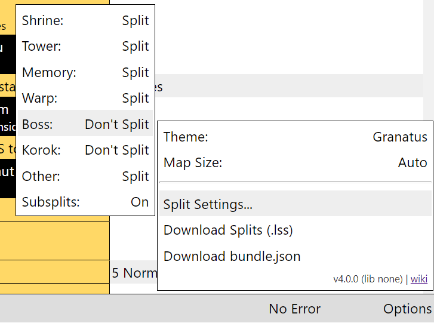
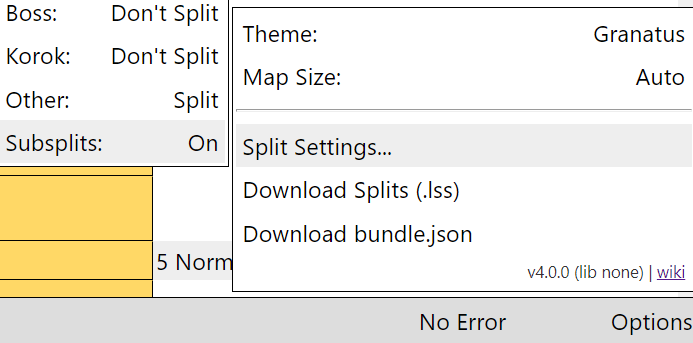

## Introduction
Export splits has been an experimental feature for a long time, and it's finally here. With this feature, you will no longer need to copy the splits from your notes to Livesplit - the web app does it for you with one click!

## Download Splits
Open any route doc. To download the splits for that route, click on `Options` and select `Download Splits (.lss)`



A `.lss` file will then be downloaded by your browser

## Split Types
The engine has 8 split types. Most of them are pre-defined with a preset, but you can also set them manually with `split-type: TYPE`
|Split Type|Description|
|-|-|
|Shrine| A Shrine|
|Tower|A Tower|
|Memory|A Picture Memory|
|Warp|A Warp|
|Boss|A Miniboss (Talus or Hinox or Molduga). The app does not have DLC bosses pre-defined|
|Korok|A Korok|
|UserDefined|A custom split point defined by user|
|None|Do not split|

You can override the split type on any preset:
```yaml
- _Shrine::KemaZoos:
    split-type: None # I don't want to split here
```

Or define your own split point:
```yaml
- Medoh done:
    icon: medoh-done
    split-type: UserDefined
```
Notice the `icon` property. **`icon` property is required on a line that has a `split-type`** You will see a warning if you define `split-type` without an icon. 

All the presets that define `split-type` also pre-define `icon`. You can also add a split type to a preset with an icon to avoid specifying your own
```yaml
- _Chest<Gold Rupee>:
    split-type: UserDefined # No error!
```
## Turn On/Off Split Types
The main purpose of having different split types is so that people can turn on/off splits at will. Maybe someone likes to split on every korok.

To configure splitting on each type, go to `Options` > `Split Settings...` and click on the corresponding type to toggle it

**Note that `Other` correspond to `UserDefined` split type**



## Subsplits
Subsplits are supported but off by default. To enable subsplits, go to `Options` > `Split Settings...` and select `Subsplits: Off`. It should now show `Subsplits: On`



When subsplits are enabled, the last split in each section will become the last split of the section (even if there are steps after that split point in the section)

Example:
```yaml
_route:                             # Splits with no subsplits      | Splits with subsplits
  Plateau:
    - Do stuff before bombs
    - _Shrine::JaBaij               # Ja Baij                       | -Ja Baij
    - Do 3 more shrines and done
    - Glider:                       # Glider                        | {Plateau}Glider
        split-type: UserDefined
        icon: king
    - Scan some amiibos # Notice that this step is technically in the Plateau section, but on the splits, it will be in the next split         
  Ganon:
    - go kill ganon
    - Dark Beast:                   # Dark Beast                    | {Ganon}Dark Beast
        icon: calamity
        split-type: UserDefined
```

## Customize Split Format
By default, the exported split names will be the same as the one shown in the doc. You might want, for example, korok counts in each shrine split. You can do that by specifying `split-format` in the `_config` property. 

The `_config` property should be at the same level as `_project` and `_route`. Example:
```yaml
_project:
  # ... detail not shown ...

_config:
  split-format:
    Warp: "Warp {{_}}"
    Shrine: "{{Korok}} - {{_}}"

_route:
  # ... route not shown ...
```
This example defines custom split formats for type `Shrine` and `Warp`. The ones that are not defined stay the same as default (i.e. same as the name shown in the doc)

#### Variable Interpolation
The split formats uses `{{` and `}}` to interpolate variables like many other scripting language. You will have access to all the variables you defined (similar to `.v(variable)` in the doc)

Additionally, the engine automatically creates these variables for you:
|Name|Description|
|-|-|
|Shrine|Shrine count: Number of shrine splits completed|
|Korok|Korok count: Number of korok splits completed|
|Tower|Tower count: Number of tower splits completed|
|Warp|Warp count: Number of warp splits completed|
|Talus|Talus count: Number of talus splits completed|
|Hinox|Hinox count: Number of hinox splits completed|
|Molduga|Molduga count: Number of molduga splits completed|

In most cases, these will equal to the number completed (i.e. the number of shrines you did, etc). However, since they count the actual `split-type`, you can manually alter the number by setting your own `split-type` or overriding pre-defined `split-type`

(These variables are also available to use in the doc. For example, you can write something like `notes: Check .v(Korok) Koroks`)

Finally, you can use `{{_}}` to interpolate the default split name (as shown in the doc. For example, the shrine name for shrines)

So, for example, `{{Korok}} - {{_}}` becomes `899 - Rona Kachta` in the Granatus route

#### Escaping
If you really need to use `{{` **and** `}}` in your split names, escape them with `{{{{` and `}}}}`. 

Only required if you are using both opening and closing braces

Examples:
- `{{{{something}}}}` becomes `{{something}}`
- `{{foo` becomes `{{foo`
- `bar}}` becomes `bar}}`

## Field Width Formatting
Suppose you want the shrine number to be `001` for the first shrine, instead of just `1`, you can use the field width formatter

The syntax is 
```
{{%XWIDTH VARIABLE}}
```
Where `{{` and `}}` is the interpolation syntax, `X` is the fill character to fill the field, `WIDTH` is the width of the field, and `VARIABLE` is the name of the variable.

For example:
```
{{%03 Shrine}}
```
will format the shrine count so it fills `0`'s to the left, until it's 3-characters wide

Another example:
```
{{%02 Korok}}
```
will be the last 2 digits of the korok count

You can use any character as the fill character:
```
{{%-2 Tower}}
```
This left-fills the tower count with the dash character (`-`)
